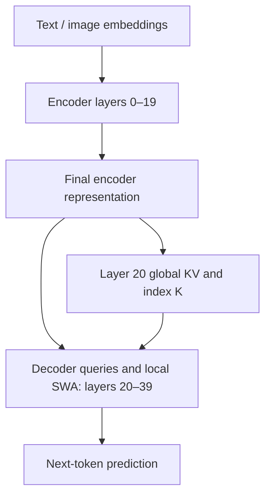
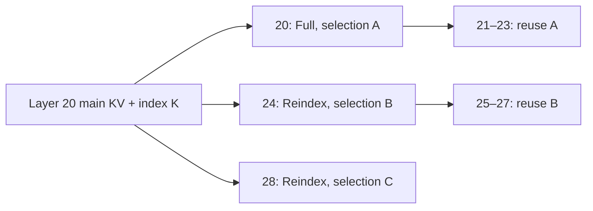

# Understanding DeepSeek V4.1-Flash sparse attention, step by step

Snapshot: 2026-09-10. All layer numbers below are **zero-based**. The target is
the released **V4.1-Flash**, whose sparse attention is **Compressed Sparse
Attention 2 (CSA2)**. The earlier V4 CSA/HCA implementation already studied in
this repository is useful background, but its compressor and layer schedule
cannot be substituted for CSA2.

This document separates the architecture from the serving implementation.
Equations and operator boundaries are checked against DeepSeek's released
[inference code][model] and [configuration][config]. The
[technical report][paper] supplies architectural motivation and deployment
details. [sglang_alignment.md](sglang_alignment.md) records what is actually
present in the inspected SGLang version; [sources.json](sources.json) pins the
sources. The accompanying Python implements the projected-tensor operators,
not the full neural network or its quantization kernels.

## 1. Begin with the two costs of ordinary attention

At token position $t$, one attention head normally computes

$$
s_{t,j}=q_t^T k_j/\sqrt d,\qquad
o_t=\frac{\sum_{j=0}^{t}e^{s_{t,j}}v_j}{\sum_{j=0}^{t}e^{s_{t,j}}}.
$$

There are two different scaling problems:

1. **Compute/read cost:** every new query scores and reads a growing history.
   Prefill evaluates a causal triangle of token pairs; decode evaluates one row.
2. **Persistent state:** historical keys and values have to remain retrievable.
   Selecting fewer positions for today's query does not make tomorrow's possible
   positions disappear from the cache.

FlashAttention improves the execution of the same dense softmax by tiling it
and avoiding a materialized score matrix. Sparse attention changes the set of
entries participating in softmax. These are compatible optimizations.

CSA2 attacks both costs through several independent choices. It stores a shared
KV latent, compresses some token groups, shares caches between layers, selects
a small subset for attention, shares selections where possible, and quantizes
the stored entries. Keep those choices separate while reading the code.

## 2. Where sparse attention sits in the whole model

The released backbone has 40 Transformer layers, split into a 20-layer causal
encoder and a 20-layer decoder. Its hidden width is 5120. Each block combines
attention and MoE through Single-Pass mHC residual mixing. The MoE has 384
routed experts, selects six, and also uses one shared expert. The model accepts
image embeddings through a vision encoder/projector; Engram adds conditional
memory; DSpark supplies separately configured speculative draft layers. These
components matter to total model cost, but none is the sparse attention
selector. In particular, **expert top-k=6 and attention top-k=512 are different
operations**. [Released configuration][config]

The encoder remains causal. “Encoder” does not mean a bidirectional view of
future tokens. CED makes decoder **global** memory depend on encoder outputs;
decoder **local** memory still depends on each decoder layer's own state.
Consequently, prompt processing can build global memory without evaluating
the complete decoder for every prompt token. Decoder SWA still requires a
replay step; §12 explains the important approximation. [Report §2.2][paper]

### 2.1 Exact attention schedule

| Layers | Stage | Global ratio $r$ | Mode | Main KV/index-K owner | Top-k producer |
|---|---|---:|---|---:|---:|
| 0–1 | Encoder | — (`0` in config) | SWA only | — | — |
| 2 | Encoder | 2 | Full | 2 | 2 |
| 3–7 | Encoder | 2 | Reuse | 2 | 2 |
| 8 | Encoder | 2 | Full | 8 | 8 |
| 9–13 | Encoder | 2 | Reuse | 8 | 8 |
| 14 | Encoder | 2 | Full | 14 | 14 |
| 15–19 | Encoder | 2 | Reuse | 14 | 14 |
| 20 | Decoder | 1 | Full + candidate pool | 20 | 20 |
| 21–23 | Decoder | 1 | Reuse | 20 | 20 |
| 24 | Decoder | 1 | Reindex | 20 | 24 |
| 25–27 | Decoder | 1 | Reuse | 20 | 24 |
| 28 | Decoder | 1 | Reindex | 20 | 28 |
| 29–31 | Decoder | 1 | Reuse | 20 | 28 |
| 32 | Decoder | 1 | Reindex | 20 | 32 |
| 33–35 | Decoder | 1 | Reuse | 20 | 32 |
| 36 | Decoder | 1 | Reindex | 20 | 36 |
| 37–39 | Decoder | 1 | Reuse | 20 | 36 |

This gives two SWA-only layers, four Full layers, four Reindex layers, and
30 Reuse layers. Four layers own the global caches; eight layers produce
selections. All 40 layers have their own local SWA. The config's compression
list has 43 entries because three trailing entries belong to DSpark; do not
mistake them for backbone layers. See [config.py](config.py) and the
[official config][config].

## 3. Tensor vocabulary: main attention versus the indexer

Use $B$ for batch size, $T$ for total available tokens, $Q$ for queries in the
current call, $N=\lfloor T/r\rfloor$ for available main-cache entries, $H$ for
main query heads, and $H_I$ for indexer query heads.

| Quantity | Logical shape | Released value / role |
|---|---|---|
| Layer input $x$ | $[B,Q,D_{model}]$ | $D_{model}=5120$ |
| Low-rank query state $q^a$ | $[B,Q,D_q]$ | $D_q=1280$ |
| Main query $q$ | $[B,Q,H,d]$ | $H=64$, $d=512$ |
| Layer-local SWA KV | $[B,T,512]$ logically | Runtime window $W=128$ |
| Shared global/main KV $c$ | $[B,N,512]$ | One KV latent shared by all heads |
| Index query $q^I$ | $[B,Q,H_I,d_I]$ | $H_I=32$, $d_I=128$ |
| Shared index keys $k^I$ | $[B,N,128]$ | Separate small search representation |
| Index head weights $w$ | $[B,Q,32]$ | Query-dependent head mixing |
| Selected global indices | $[B,Q,K]$ | $K=512$, independent of main head |
| Candidate position IDs | $[B,Q,C]$ | $C\le 2048\times8=16384$ |

All heads of a query use the same selected **positions**. Their main queries
differ, so their attention scores, probabilities and outputs differ.

The released attention represents K and V with the same 512-dimensional
latent. Do not expand this into 64 stored KV heads, and do not silently assume
the exact V3 MLA cache layout. Main and indexer queries share the low-rank
query input but have different output projections:

$$
q^a=\operatorname{RMSNorm}(xW_{qa}),\quad
q=\operatorname{RoPE}(\operatorname{reshape}(q^aW_{qb})),\quad
q^I=\operatorname{RoPE}(\operatorname{reshape}(q^aW^I_{qb})).
$$

RoPE rotates the last 64 channels of the relevant vectors. The global/SWA
CSA2 path uses the configured long-context position scheme; the first two
SWA-only layers have a separate base-RoPE policy. Long-context reproduction
must include YaRN and the correct frequencies, not just “some RoPE”. These
operations are visible in `Attention.forward` and `Indexer.forward` in the
[released model][model].

## 4. Preserve nearby details with sliding-window attention

Every layer keeps a local window

$$
\mathcal W_t=\{\max(0,t-W+1),\ldots,t\},\qquad W=128.
$$

This branch includes the current token and nearby tokens without consulting
the global indexer. It therefore provides a direct local path even when a
global token group is incomplete or the indexer misses a distant reference.
Each layer computes its own local KV projection and normalization.

At decode, the local cache can be a ring buffer: token $t$ writes slot $t\bmod W$.
The slot is a physical storage address, not an absolute token position. In the
teaching code `window_indices` uses a contiguous logical history so you can
inspect the mask; the official `_window_kv` uses a ring at decode. A serving
adapter must translate between those conventions. [Reference `_window_kv`][model]

## 5. Compress the encoder history, two tokens at a time

At a Full encoder layer, project a value vector $u_i$ and a gate vector $g_i$
for each input token. For group $j$ and channel $a$:

$$
\alpha_{j,i,a}=
\frac{\exp(g_{jr+i,a})}{\sum_{v=0}^{r-1}\exp(g_{jr+v,a})},\qquad
\widetilde c_{j,a}=\sum_{i=0}^{r-1}\alpha_{j,i,a}u_{jr+i,a},
\quad 0\le i<r.
$$

Then $c_j^{pre}=\operatorname{RMSNorm}(\widetilde c_j)$ is the unrotated main
latent. The gate softmax runs **over tokens within the group, separately for
each channel**. It is not one scalar weight per token and is not a softmax
over channels. Uniform gates reduce the operator to a mean; learned gates
let different channels keep information from different group members.

For $r=2$, groups are $(0,1),(2,3),(4,5),\ldots$. CSA2 has neither overlapping
source groups nor the earlier CSA compressor's extra absolute position
embedding. At $r=1$ in the decoder, the global compressor reduces to a
projection followed by RMSNorm; there is no token pooling and no gate.
[Reference `Compressor`][model]

### 5.1 A compressed group must be complete before it is visible

At query position $t$, group $j$ is visible exactly when

$$
jr+r-1\le t
\quad\Longleftrightarrow\quad
j<\left\lfloor\frac{t+1}{r}\right\rfloor.
$$

| Query $t$, ratio 2 | Complete global entries | Most recent unfinished group |
|---:|---|---|
| 0 | none | token 0 |
| 1 | group 0: tokens 0–1 | none |
| 2 | group 0 | token 2 |
| 3 | groups 0–1 | none |
| 4 | groups 0–1 | token 4 |

Rotary position and availability are different: group $j$ uses RoPE position
$jr$, the **first** token in the group, while it becomes visible only when the
**last** token arrives. Using first-token visibility would leak future tokens
during prefill. Computing all compressed entries in parallel is valid only
if each query's mask enforces the completion condition.

`StreamingCompressor` retains incomplete projected values and gates across
chunk boundaries. Its tests compare chunked and token-by-token execution
against whole-prefix compression, including odd lengths. RMSNorm and RoPE
are deliberately outside this small pooling operator.

## 6. Build a cheap search representation from the main latent

The indexer is a learned retrieval side path. Its key comes from the
**unrotated** main latent:

$$
k_j^I=\operatorname{QuantDequant}_{MXFP4}
\left(\operatorname{RoPE}_{jr}
\left(\operatorname{RMSNorm}(c_j^{pre} W_k^I)\right)\right).
$$

The stored main latent instead follows

$$
c_j=\operatorname{QuantDequant}_{FP4,16}
\left(\operatorname{RoPE}_{jr}(c_j^{pre})\right).
$$

Thus the index-key projection must run before an in-place operation overwrites
the main latent with its rotated/quantized version. The two caches describe
the same global positions but have different dimensions and quantization
formats. Reindex layers read the owner's index keys; they do not reconstruct
them from their own hidden states. [Reference `Indexer` and `_compress_kv`][model]

For one query, the indexer computes

$$
I_{t,j}=\sum_{h=1}^{H_I}w_{t,h}
\operatorname{ReLU}\left((q^I_{t,h})^T k^I_j\right),\qquad
w_{t,h}=\frac{(x_tW_{weights})_h}{\sqrt{d_I}\sqrt{H_I}}.
$$

The head weights are linear projection outputs and may be negative. ReLU is
applied **before** head weighting. Do not replace this with
$\operatorname{ReLU}(\sum_h w_h q_h^Tk)$, or add an indexer softmax: either
would change the ranking. For tensor-parallel indexer heads, the partial
head sums must be reduced before global top-k. The actual main-attention
softmax comes later.

Invalid/future positions receive $-\infty$ before selection:

$$
\mathcal S_t=\operatorname{TopK}_{j\;\mathrm{visible}}(I_{t,j}),\quad K=512.
$$

This is a learned proxy for useful main KV, not an exact algorithm for finding
the top main-attention scores. The small indexer avoids scoring every entry
with all 64 wide main heads. See `index_scores` and `causal_index_scores` in
[csa2_reference.py](csa2_reference.py).

## 7. Run one attention over local and selected global memory

For each main head, concatenate **entries** from the local branch and selected
global branch. Let $\mathcal A_t$ denote that concatenated list and $z_a$ the
corresponding latent. Then

$$
\ell_{t,h,a}=q_{t,h}^T z_a/\sqrt{512},\qquad
o_{t,h}=\frac{\sum_{a\in\mathcal A_t}\exp(\ell_{t,h,a})z_a}
{\exp(b_h^{sink})+\sum_{a\in\mathcal A_t}\exp(\ell_{t,h,a})}.
$$

There is **one joint denominator**. Computing two separately normalized
attentions and adding them is not the same operation. The learned per-head
sink is an extra logit with a zero value: it absorbs probability mass without
contributing to the numerator. It is not a retained beginning-of-sequence
token. Its logit is not multiplied by the query/key scale.

With zero logits, one local value 2, one global value 4, and a zero sink logit,
the result is $(2+4)/(1+1+1)=2$. This exact example is a unit test.

Local and global representations may cover the same original token. They are
different cache entries with different projections/owners, so do not remove
one as a duplicate. Selection produces at most $128+512=640$ value entries per
head plus the sink. Early prefixes have fewer valid entries. Padded IDs use
`-1`; the padding must not silently gather the last element as Python indexing
would. [Reference `sparse_attn` kernel][kernel]

The kernel result still needs inverse RoPE on its trailing rotary channels,
then the grouped low-rank output projection. Eight output groups each combine
their own main heads, project to width 1024, and feed the final projection
back to width 5120. Our `joint_sparse_attention` ends **before** inverse RoPE
and these projections. [Reference `Attention.forward`][model]

## 8. Share caches and selections across layers

The three modes answer two separate questions: **who writes memory?** and
**who chooses which positions to read?**

| Operation | Full | Reindex | Reuse |
|---|---|---|---|
| Compute current main Q and local SWA KV | Yes | Yes | Yes |
| Produce main KV and index K | Yes | Read latest Full owner | Read latest Full owner |
| Compute current index Q and head weights | Yes | Yes | No |
| Score and select global positions | Yes | Yes | Read latest index producer |
| Run main sparse attention | Yes | Yes | Yes |

“Full” means all **CSA2 components execute**. It does not mean dense global
main attention. Full layers still select top-512 for the main softmax.

Consider decoder layers 20–25. Layer 20 owns the decoder global memory and
computes a selection. Layers 21–23 read those same positions with their own
main queries and local KV. Layer 24 reads the same shared memory but computes
a fresh selection with its own indexer query. Layer 25 reads layer 24's
selection. Reuse therefore shares neither attention outputs nor attention
probabilities.

The shared routing state belongs to a particular request/query batch and
forward pass. Token $t+1$ must generate new Full-layer selections; reusing
token $t$'s IDs is not CSA2's cross-layer reuse. Likewise, reordering requests
in a serving batch requires consistent reindexing of all associated state.
The teaching `CSA2Router` requires all 40 layers in order and a new router for
each query batch; persistent KV is supplied by the caller. The official
minimal model uses a process-global `SharedAttentionRuntime`, valid under its
single-model sequential execution assumptions. A concurrent server needs an
explicit request/batch lifetime. [Reference shared runtime][model]

## 9. Bound later decoder searches with hierarchical indexing

Sharing top-k reduces the **number** of indexers, but layer 24 would still
score the entire decoder cache if it performed a normal global search. CSA2
adds a candidate pool produced at decoder layer 20:

1. Score all causally visible global positions at layer 20.
2. Independently select that layer's top-512 for main attention.
3. Partition global positions into groups of eight and score each group by
   its maximum index score.
4. Keep up to 2048 groups. Their positions form a pool of at most 16384 IDs.
5. Layers 24, 28, 32 and 36 score only that pool and choose their own top-512.

The candidate pool is much larger than the final selection. It preserves room
for deeper queries to choose positions the first main-attention selection did
not contain. It is shared across these decoder indexers for the same query,
not repeatedly narrowed after each Reindex layer. The initial Full-layer
scan still grows with context. [Reference candidate helper][model]

### 9.1 Numerical example

Use block size 2, two candidate blocks, final top-k=2, and six visible scores:

| Global position | 0 | 1 | 2 | 3 | 4 | 5 |
|---|---:|---:|---:|---:|---:|---:|
| First indexer score | 9 | 1 | 8 | 7 | 0 | -2 |
| Block maximum | 9 | 9 | 8 | 8 | 0 | 0 |

The released helper **pins the newest reachable block** so recent positions
remain candidates, even if its score is low. With a two-block budget, keep
blocks `[0,1]` and `[4,5]`, yielding candidate positions `{0,1,4,5}`. The first
layer's own top-2 remains `{0,2}` because its main selection is computed from
the full visible range, independently of the candidate pool.

A later indexer could give these candidates scores `{1,0,10,9}` and select
`{4,5}`. It may not choose position 3, however large its hypothetical global
score would have been. This restriction is an architectural tradeoff: a
candidate excluded by layer 20 cannot be recovered by later decoder indexers
for this query. Local SWA still supplies its separate recent-token branch.

The pin occupies one of the 2048 slots; it is not an extra 2049th block.
If the newest block is partial, only its causally visible positions can be
selected. Empty prefixes require an empty valid selection. The tests exercise
these cases against the official helper.

### 9.2 Sparse mathematics does not automatically give sparse execution

The released minimal `Indexer.forward` calculates full-context scores, then
masks positions outside the candidate pool. This is a readable semantic
reference, but that ordering does **not** deliver context-independent deeper
indexer work. Our `reindex_candidates` instead gathers candidate keys first
and computes a $[B,Q,H_I,C]$ score tensor. It is tested against a dense-score
then mask oracle. A production kernel should additionally avoid materializing
large gathered tensors and should tile the selected blocks.

At one million positions, replacing a deeper search over $1,048,576$ entries
with at most $16,384$ candidates reduces its score-domain width by 64×. This
is an arithmetic ratio, not a measured 64× latency improvement: gathers,
bandwidth, launch overhead, top-k and the mandatory initial scan still cost time.

## 10. Quantization and the derivation of 890 bytes/token

The cache has two different FP4 representations:

| Stored item | Data | Scale granularity | Ideal bytes per global entry |
|---|---|---|---:|
| Main KV, 512 channels | E2M1 (4 bits/channel) | One E4M3 byte / 16 channels | $256+32=288$ |
| Index K, 128 channels | E2M1 (4 bits/channel) | One E8M0 byte / 32 channels | $64+4=68$ |

Main KV is quantized after RoPE, including the rotary channels. The reference
uses the E4M3-scale variant without an additional global scale. Indexer Q/K
use MXFP4. Local SWA KV remains FP8. A serving cache must preserve these
different formats rather than treating every FP4 tensor as interchangeable.
[Reference quantization calls][model], [quantization kernels][kernel]

Now count **owners**, rather than layers. There are three ratio-2 encoder
owners and one ratio-1 decoder owner. Therefore the ideal global cache payload
for $T$ tokens is

$$
M_{global}(T)=\left(3\lfloor T/2\rfloor+T\right)(288+68).
$$

For even $T$:

$$
\frac{M_{global}(T)}T=(3/2+1)\times356=\boxed{890\text{ bytes/token}}.
$$

The main KV contribution is 720 bytes/token and the index K contribution is
170 bytes/token. Index reuse alone would not yield this storage reduction:
the saving depends on KV/index-K ownership sharing as well.

| Context $T$ | Ideal global payload |
|---:|---:|
| 4096 | 3.4765625 MiB |
| 65536 | 55.625 MiB |
| 1048576 | 890 MiB |

These are calculations from the released shapes, reproduced by
`global_cache_bytes`. They exclude weights, local SWA windows, unfinished
compressor state, candidate/index buffers, page padding, allocator overhead,
activations, and replication across devices. Consequently, 890 MiB is not the
total GPU memory needed to serve a one-million-token request.

The official minimal Python cache buffers are floating-point tensors with
in-place quantize/dequantize simulation. Their allocated tensor bytes are not
the ideal packed-FP4 bytes calculated above. Our reference also uses ordinary
floating-point tensors; it does not physically pack these formats.

## 11. Follow one decode step through the stack

Let $T$ be the token count **including the newly appended token**, so its
position is $t=T-1$. Earlier main caches already exist.

1. Layers 0–1 update their SWA windows and run local attention.
2. At layer 2, update its local window and compressor state. Emit a new main
   latent/index key only when the ratio-2 group completes. In either case,
   compute this token's indexer Q and a fresh top-k over complete entries.
3. Layers 3–7 compute their own main Q/local KV and attend using layer 2's
   shared global cache and indices. Repeat at owners 8 and 14.
4. The encoder produces the representation from which layer 20 projects the
   decoder's ratio-1 global entry and index key. This happens every token.
5. Layer 20 performs the full-context index scan, its top-512, and candidate
   selection. Layers 21–23 reuse its selection.
6. Layer 24 selects a new top-512 from the shared candidates; layers 25–27
   reuse it. Repeat for index producers 28, 32 and 36.
7. Each attention output passes through inverse RoPE/output projections and
   the surrounding block computation. Final normalization/head produces
   next-token logits.

A ratio-2 Full layer still runs its indexer on tokens where no new compressed
entry is emitted. “No cache append” does not imply “no query computation”.
Future sparse selections can revisit any still-stored global entry; entries
not selected on this step are not evicted merely for that reason.

### 11.1 Work accounting: what is and is not constant

Ignoring dimensions and kernel overhead, the number of index-key positions
scored across the backbone for one decode query is bounded by

$$
P(T)=3\lfloor T/2\rfloor + T + 4\min(T,16384).
$$

The terms are three encoder Full scans, one decoder Full scan, and four
bounded decoder Reindex scans. Reuse layers contribute zero index scoring.
Multiply each scored position by roughly $H_Id_I$ dot-product work (and
include the head reduction) to estimate the index arithmetic, not latency.

| Context | Scored index positions over backbone |
|---:|---:|
| 4096 | 26624 |
| 65536 | 229376 |
| 1048576 | 2686976 |

The main sparse core per query is bounded by $O(Hd(W+K))$ per sparse layer.
However, the Full index scans and retained global cache still grow with $T$.
**CSA2 is not asymptotically constant-cost decode and is not a fixed-state
linear-attention recurrence.** Dense Full-indexer prefill still contains a
quadratic token-pair component for a fixed compression ratio. Candidate-first
deeper indexing changes those deeper terms, not the initial full scans.

To benchmark it later, separate projection/normalization, compression/cache
writes, full indexing, block selection, candidate indexing, sparse attention,
and output projection. Measure Full, Reindex and Reuse independently before
weighting by the released schedule. GPU timings from the older V4 or KDA
directories cannot be relabeled as V4.1 measurements.

## 12. Prefill, prefix-cache hits, and bounded replay

Plain whole-sequence execution is easy to understand: compute each layer for
all tokens with causal compression and window masks. The released minimal
`Transformer.forward` does just that through its layer loop; it is not an
optimized CED prefill scheduler. [Reference Transformer][model]

The deployed CED path can evaluate the encoder for the prompt and construct
decoder global memory from its outputs. Decoder local memory still needs the
decoder stack. The deployment solution described in the report is **bounded
SWA replay**: process the last window's tokens through the decoder to seed its
local windows. Missing encoder SWA on a global-prefix-cache hit can also be
reconstructed by replaying a short prefix tail. [Report §3.2.2][paper]

For replay starting at absolute position $s$, the local support becomes

$$
\mathcal W_t^{replay}=\{\max(s,t-W+1),\ldots,t\}.
$$

This excludes some historical local dependencies near the replay boundary.
Across many layers, those dependencies propagate; replaying only $W$ tokens
does **not** reproduce the full decoder's SWA states exactly. It is a trained
and empirically evaluated approximation, distinct from exact cache reuse.

For implementation, retain absolute positions during replay; reuse existing
global prefix entries without rewriting them from approximate states; append
new global entries only for new suffix tokens; preserve partially completed
encoder compression groups; and regenerate query-specific selections for the
replayed queries. The suffix states can depend on the replay/cache-hit boundary.
Our tutorial does not implement this scheduler or claim exact replay parity.

## 13. Training: why these restrictions can work

Top-k selects discrete positions, so a hard selection operation is not a
smooth substitute for full attention. The indexer must learn useful rankings;
cache sharing also forces several layers to interpret a common memory.
Do not assume replacing attention in an arbitrary existing model with these
operators preserves its behavior.

The report distinguishes sparse pretraining from later adaptations: sparse
attention starts without a dense warmup; hierarchical candidate restrictions
and main-KV FP4 quantization are made training-aware during post-training.
It also describes coordination of shared representations and indexers across
pipeline stages. A Reuse layer having no local indexer parameters does not
mean its output is irrelevant to training the shared memory. The released
inference code does not provide a complete training-loss implementation, so
this study does not invent an indexer-loss coefficient or claim to reproduce
CSA2 training. [Report §§2.3.2, 2.4.4, 3.1.2, 4.2.2][paper]

## 14. Relate this to the KDA study

| Question | KDA | CSA2 |
|---|---|---|
| Where does history live? | Fixed-size recurrent matrix per head | Growing global latent cache plus local windows |
| How is it read? | Query reads an accumulated fast-weight state | Indexer selects entries; main queries run softmax |
| What is compressed? | Historical updates into a recurrent state | Channels/precision, token groups, and duplicated layer caches |
| Can it revisit a specific stored old entry? | Through the accumulated state | Yes, if selected from retained global memory |
| Decode dependence on context | Recurrence state size is fixed | Full-indexer scans and global storage grow |
| State sharing in this study | Recurrent state across tokens | Global KV and routing across layers for a query |

Both approaches trade representational freedom for less memory traffic, but
their states and performance limits differ. KDA's gate controls a recurrent
memory update; CSA2's compressor gate mixes channels within a short token
group. Do not transfer the delta-rule recurrence or WY chunk algebra into
CSA2. See the local [KDA notes](../attention/linear_attn/KDA.md).

## 15. Read the implementation in this order

1. `config.layer_spec`: identify cache owners and index producers. Run
   `python3 -m deepseek.demo --schedule` and compare with §2.1.
2. `gated_compress`, then `StreamingCompressor`: compare whole-prefix pooling
   with odd chunk boundaries and no-yet-complete groups.
3. `causal_index_scores`, then `select_topk`: inspect masking before selection.
4. `select_candidates`, then `reindex_candidates`: distinguish block ranking,
   candidate membership, and final selected IDs. Notice gathering before scores.
5. `joint_sparse_attention`: check one denominator, the sink, K=V, and `-1` masks.
6. `CSA2Router`: trace memory identity through Full → Reuse → Reindex → Reuse.
7. [sglang_alignment.md](sglang_alignment.md): replace logical tensors with
   runtime page tables and kernel contracts only after the math is clear.

Try `--seq-len 32 --query 0` to see an encoder query with no complete global
group, and `--query 17` to inspect a prefix query while later tokens are present
in the prefill tensors. The unit tests verify causal-prefix invariance and
gathered sparse attention against an independently masked dense oracle.

### Common interpretation errors to check yourself against

- Calling Full mode dense attention, or calling Reuse an output cache.
- Reusing a selection at the next token rather than the next layer.
- Using V4's overlapping ratio-4 compressor for V4.1's ratio-2 path.
- Projecting index K after overwriting the unrotated main latent.
- Treating a candidate block, compression group and allocator page as one unit.
- Letting an incomplete compression group or future candidate position leak.
- Adding independently normalized SWA and global attention outputs.
- Dropping the sink, forgetting inverse RoPE, or deduplicating distinct branches.
- Equating a floating-point reference allocation with a packed FP4 cache.
- Claiming bounded total decode cost because four deeper indexers are bounded.
- Claiming native SGLang V4.1 support from a generic model-hub launch snippet.

[model]: https://huggingface.co/deepseek-ai/DeepSeek-V4.1-Flash/blob/dba1be0a40aa45a94ad051997016db3960a90277/inference/model.py
[kernel]: https://huggingface.co/deepseek-ai/DeepSeek-V4.1-Flash/blob/dba1be0a40aa45a94ad051997016db3960a90277/inference/kernel.py
[config]: https://huggingface.co/deepseek-ai/DeepSeek-V4.1-Flash/blob/dba1be0a40aa45a94ad051997016db3960a90277/config.json
[paper]: https://huggingface.co/deepseek-ai/DeepSeek-V4.1-Flash/resolve/dba1be0a40aa45a94ad051997016db3960a90277/DeepSeek_V41_Tech_Report.pdf
